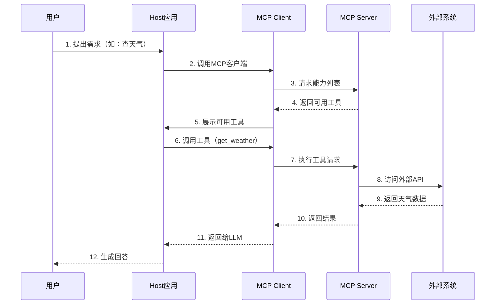

# MCP 基础知识（Model Context Protocol）

> 💡 **使用指南**：本文件偏重 MCP 的概念、架构和核心组件，适合作为「第二层：理论笔记」。  
> 实际工程接入方式、代码模板和配置示例，建议结合：  
> - 📄 `MCP使用方式速查表.md` - 三种使用方式（Stdio / HTTP / 自定义传输）的速查与代码片段  
> - 📊 `MCP_Agent_Agno对比.md` - MCP、Agent 框架、Agno 之间的关系对比  
>
> 总体阅读顺序：**本文件理解概念 → 看速查表写 Demo → 结合对比文档理解在 Agent 体系中的位置**。

## 📘 什么是 MCP？

**MCP (Model Context Protocol)** 是 Anthropic 于 2024年11月推出的**开源标准协议**，用于规范大语言模型（LLM）与外部数据源和工具的交互。

### 核心目标

- 🎯 **标准化接口**：统一LLM与外部系统的通信方式
- 🔄 **动态上下文**：让AI实时获取外部信息，突破训练数据限制
- 🔌 **即插即用**：一次实现，到处使用

---

## 🏗️ MCP 架构

MCP 采用 **客户端-服务器（Client-Server）** 架构：

```
┌─────────────────────────────────────────┐
│          Host (主机应用)                 │
│  ┌─────────────────────────────────┐   │
│  │  LLM (Claude/GPT/DeepSeek...)   │   │
│  └─────────────────────────────────┘   │
│           ↕️ 调用                       │
│  ┌─────────────────────────────────┐   │
│  │   MCP Client (客户端)            │   │
│  └─────────────────────────────────┘   │
└──────────────┬──────────────────────────┘
               │ MCP 协议
               ↕️
┌──────────────┴──────────────────────────┐
│      MCP Server (服务器)                 │
│  ┌──────────┐ ┌──────────┐ ┌─────────┐  │
│  │Resources │ │  Tools   │ │ Prompts │  │
│  └──────────┘ └──────────┘ └─────────┘  │
│       ↓            ↓            ↓       │
│  数据库      API服务      模板库         │
└─────────────────────────────────────────┘
```

### 三大角色

| 角色 | 说明 | 职责 |
|------|------|------|
| **Host (主机)**     | 完整的 LLM 应用 | 管理客户端、执行安全策略、处理授权 |
| **Client (客户端)** | 主机内的连接器   | 声明能力需求、与服务器通信        |
| **Server (服务器)** | 能力提供者      | 提供 Resources、Tools、Prompts   |

---

## 🎁 MCP 三大核心组件

### 1️⃣ Resources (资源)

**定义**：只读的数据源，提供上下文信息

**特点**：
- 📖 只读（Read-Only）
- 📄 可以是文本、图片、文档等
- 🔍 支持动态获取

**应用场景**：
```python
# 示例：获取文档内容
resource = {
    "uri": "file:///docs/manual.md",
    "name": "用户手册",
    "mimeType": "text/markdown"
}
```

**典型用途**：
- 读取知识库文档
- 获取数据库记录
- 访问API数据

---

### 2️⃣ Tools (工具)

**定义**：可执行的函数，可修改外部状态

**特点**：
- ⚙️ 可执行操作
- ✍️ 可修改数据
- 🔧 带有参数和返回值

**应用场景**: 
```python
# 示例：天气查询工具
tool = {
    "name": "get_weather",
    "description": "获取指定城市的天气信息",
    "parameters": {
        "city": {
            "type": "string",
            "description": "城市名称"
        }
    }
}
```

**典型用途**：
- 发送邮件
- 创建任务
- 执行计算
- 调用API

---

### 3️⃣ Prompts (提示词模板)

**定义**：预定义的提示词模板，可重用

**特点**：
- 📝 模板化
- 🔄 可重用
- 📋 带参数

**应用场景**：
```python
# 示例：代码审查提示词
prompt = {
    "name": "code_review",
    "description": "代码审查模板",
    "arguments": [
        {
            "name": "code",
            "description": "要审查的代码",
            "required": True
        }
    ]
}
```

**典型用途**：
- 标准化问题模板
- 固定工作流程
- 最佳实践分享

---

## 🔄 MCP 工作流程



---

## 💡 MCP vs 传统方式

### 传统方式（每个应用独立实现）
```
应用A → 自定义接口 → 数据库
应用B → 自定义接口 → 数据库
应用C → 自定义接口 → 数据库
```
❌ 重复开发、难以维护、不可复用

### MCP方式（标准化协议）
```
应用A ┐
应用B ├→ MCP协议 → MCP Server → 数据库
应用C ┘
```
✅ 一次实现、统一标准、到处使用

---

## 🎮 MCP 的使用方式

MCP 有 **3 种主要使用方式**，适用于不同场景：

---

### 方式 1️⃣：本地进程（Stdio）- 最常用 ⭐

**原理**：通过标准输入输出（stdin/stdout）通信

**适用场景**：
- ✅ Claude Desktop 集成
- ✅ 本地开发测试
- ✅ 个人工具

**配置方式**：
```json
// Claude Desktop 配置文件
{
  "mcpServers": {
    "weather": {
      "command": "python",
      "args": ["weather_server.py"]
    }
  }
}
```

**Server 代码**：
```python
from mcp.server.stdio import stdio_server

# 使用 stdio 传输
async def main():
    async with stdio_server() as (read_stream, write_stream):
        await server.run(read_stream, write_stream)

if __name__ == "__main__":
    asyncio.run(main())
```

**特点**：
- ✅ 简单直接
- ✅ 无需网络配置
- ✅ 安全性高（本地运行）
- ❌ 不能远程访问

---

### 方式 2️⃣：HTTP/SSE（Server-Sent Events）- 适合远程 🌐

**原理**：通过 HTTP 协议通信，使用 SSE 推送事件

**适用场景**：
- ✅ 多用户共享
- ✅ 远程部署
- ✅ 企业级应用
- ✅ 云服务

**Server 端**：
```python
from mcp.server.sse import SseServerTransport
from starlette.applications import Starlette
from starlette.routing import Route

app = Starlette(
    routes=[
        Route("/sse", endpoint=sse_endpoint),
    ]
)

async def sse_endpoint(request):
    async with SseServerTransport("/messages") as transport:
        await server.run(
            transport.read_stream,
            transport.write_stream
        )
```

**Client 端配置**：
```json
{
  "mcpServers": {
    "weather": {
      "url": "http://localhost:8000/sse"
    }
  }
}
```

**特点**：
- ✅ 支持远程访问
- ✅ 可以多客户端共享
- ✅ 易于部署到云端
- ❌ 需要网络配置
- ❌ 需要考虑安全性

---

### 方式 3️⃣：自定义传输（Custom Transport）- 高级 🔧

**原理**：实现自己的传输层

**适用场景**：
- 特殊网络环境
- WebSocket 通信
- 消息队列集成

**示例**：
```python
from mcp.server import Server
from mcp.shared.transport import Transport

class CustomTransport(Transport):
    async def read(self):
        # 自定义读取逻辑
        pass
    
    async def write(self, data):
        # 自定义写入逻辑
        pass

# 使用自定义传输
transport = CustomTransport()
await server.run(transport.read_stream, transport.write_stream)
```

---

## 🚀 快速上手示例

### 最简单的 MCP Server（Stdio 方式）

```python
# weather_server.py
import asyncio
from mcp.server import Server
from mcp.server.stdio import stdio_server

# 创建服务器
server = Server("weather-server")

@server.tool()
def get_weather(city: str) -> str:
    """获取城市天气"""
    return f"{city}: 晴天, 25℃"

@server.resource("weather://current")
def current_weather() -> str:
    """当前天气资源"""
    return "实时天气数据..."

# 使用 stdio 传输启动
async def main():
    async with stdio_server() as (read_stream, write_stream):
        await server.run(
            read_stream,
            write_stream,
            server.create_initialization_options()
        )

if __name__ == "__main__":
    asyncio.run(main())
```

### HTTP 方式的 MCP Server

```python
# weather_http_server.py
from mcp.server import Server
from mcp.server.sse import SseServerTransport
from starlette.applications import Starlette
from starlette.routing import Route
import uvicorn

server = Server("weather-server")

@server.tool()
def get_weather(city: str) -> str:
    return f"{city}: 晴天, 25℃"

async def handle_sse(request):
    async with SseServerTransport("/messages") as transport:
        await server.run(
            transport.read_stream,
            transport.write_stream,
            server.create_initialization_options()
        )

app = Starlette(
    routes=[
        Route("/sse", endpoint=handle_sse),
    ]
)

if __name__ == "__main__":
    uvicorn.run(app, host="0.0.0.0", port=8000)
```

---

## 🎯 应用场景

| 场景 | 说明 | 示例 |
|------|------|------|
| **知识库集成** | AI访问企业文档 | 查询公司规章制度 |
| **数据库查询** | 动态查询数据 | 查询销售数据 |
| **API调用** | 调用第三方服务 | 天气、股票、地图 |
| **自动化任务** | 执行操作 | 发邮件、创建日程 |
| **代码助手** | 访问代码库 | 查找函数定义 |
| **客服系统** | 访问工单系统 | 查询订单状态 |

---

## ⚡ MCP 的优势

✅ **标准化**：统一接口，降低集成成本  
✅ **安全性**：内置权限控制和授权机制  
✅ **可扩展**：轻松添加新能力  
✅ **复用性**：一次开发，多处使用  
✅ **生态系统**：丰富的社区资源  

---

## 🛠️ 常见 MCP Server

| Server | 功能 | 用途 |
|--------|------|------|
| **filesystem** | 文件系统访问 | 读写本地文件 |
| **postgres** | 数据库查询 | 查询PostgreSQL |
| **slack** | Slack集成 | 发送消息、查询频道 |
| **github** | GitHub操作 | 管理仓库、PR |
| **google-drive** | Google Drive | 访问云端文件 |
| **brave-search** | 网络搜索 | 实时搜索信息 |

---

## 📚 学习资源

- **官方文档**：https://modelcontextprotocol.io
- **GitHub仓库**：https://github.com/modelcontextprotocol
- **示例代码**：https://github.com/modelcontextprotocol/servers
- **中文教程**：https://mcp.meetcoding.cn

---

## 🎓 核心概念总结

```python
# MCP = 三大组件 + 标准协议

MCP {
    Resources:  "只读数据"     # 提供上下文
    Tools:      "可执行操作"   # 修改状态
    Prompts:    "提示模板"     # 重用工作流
    
    + 标准通信协议 (JSON-RPC)
    + 客户端-服务器架构
    + 安全授权机制
}
```

---

## 🤔 常见问题

### Q1: MCP 和 Function Calling 有什么区别？
**A:** 
- Function Calling：模型内置的工具调用能力
- MCP：标准化的外部系统集成协议

MCP 更加标准化、可扩展，支持更复杂的场景。

### Q2: 所有LLM都支持MCP吗？
**A:** 不是。目前主要支持：
- Claude (原生支持)
- 其他模型需要通过适配器

### Q3: MCP Server 必须是远程的吗？
**A:** 不是。可以是：
- 本地进程（最常见）
- HTTP服务
- 其他通信方式

---

## 🔑 关键要点

1. **MCP是协议，不是框架** - 定义了通信标准
2. **三大组件各司其职** - Resources读、Tools写、Prompts模板
3. **客户端-服务器架构** - 清晰的职责分离
4. **一次实现，到处复用** - 核心价值所在

---

*最后更新：2025年*

